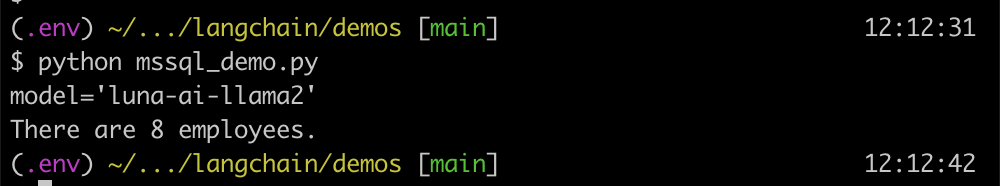
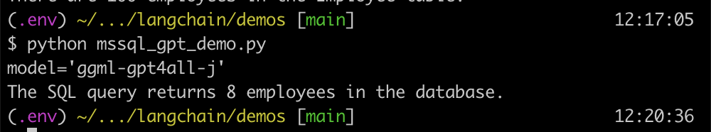

# Langchain Demos

These demos for using [Langchain](https://python.langchain.com/docs/get_started/introduction) to interact with an MSSQL database on an M1 mac.

Models used for demos are:

- [Llama 2](https://ai.meta.com/llama/)
- [ggml-gpt4all](https://gpt4all.io/index.html)

## required:
- Minimum of 16GB of memory

## steps

- compile [LocalAI](https://localai.io/basics/build/)

```bash
brew install abseil cmake go grpc protobuf wget
git clone https://github.com/go-skynet/LocalAI.git
cd LocalAI
make BUILD_TYPE=metal build
```

- download models and put them into models folder in `LocalAI` directory.

- run LocalAI

```bash
./local-ai --models-path=./models/ --debug=true
```

- run the mssql databse locally (here is a docker based example)

```bash
git clone https://github.com/ammarnajjar/mssql-local.git
cd mssql-local
docker-compose up -d
```

- install python dependencies

```bash
python -m venv .env
source .env/bin/activate
pip install -r requirements.txt
pip uninstall pyodbc
pip install --no-binary :all: pyodbc
```

- check which drivers are available for python:

```python
for driver in pyodbc.drivers():
    print(driver)
```
use the outcome in the demo connection strings to connect to the mssql database.

- run the demo of choice

```bash
python mssql_demo.py
```
example output:



```bash
python mssql_gpt_demo.py
```
example output:



## versions used:

- LocalAI (commit efe2883c): closest tag: [v2.6.0](https://github.com/mudler/LocalAI/releases/tag/v2.6.0)

